# PropNest: Property Management System
## Complete Workflow & Visual Process Guide

> **Project Environment**: Laravel 12 on PHP 8.4 (Herd)  
> **Application URL**: `http://propertysystem.test` (Local Dev: `http://127.0.0.1:8000`)  
> **Architecture**: Role-Based Access Control (Tenant & Landlord/Administrator), Tailwind CSS v4, SQLite

---

### Executive Architecture Overview

PropNest is a full-featured Property Management Platform built around **Five Key Design Components**, engineered to seamlessly balance tenant self-service with landlord administration.

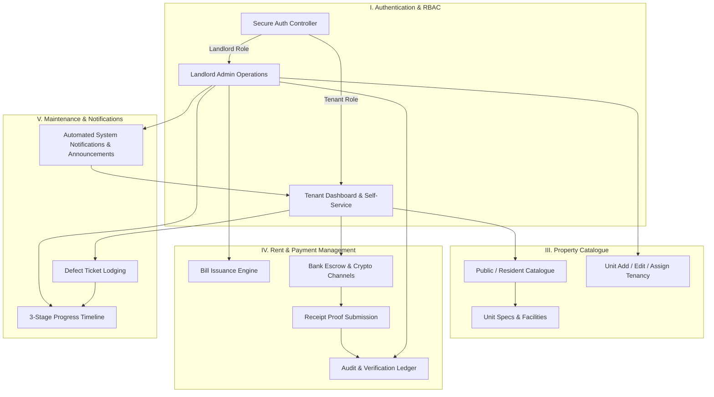
```mermaid
flowchart TD
    subgraph Component_I["I. Authentication & RBAC"]
        Auth[Secure Auth Controller] -->|Tenant Role| TRole[Tenant Dashboard & Self-Service]
        Auth -->|Landlord Role| LRole[Landlord Admin Operations]
    end

    subgraph Component_III["III. Property Catalogue"]
        Cat[Public / Resident Catalogue]
        PDetail[Unit Specs & Facilities]
        PAdmin[Unit Add / Edit / Assign Tenancy]
        LRole --> PAdmin
        TRole --> Cat
        Cat --> PDetail
    end

    subgraph Component_IV["IV. Rent & Payment Management"]
        BillGen[Bill Issuance Engine]
        PayChannels[Bank Escrow & Crypto Channels]
        PaySubmit[Receipt Proof Submission]
        PayLedger[Audit & Verification Ledger]
        LRole --> BillGen
        LRole --> PayLedger
        TRole --> PayChannels
        PayChannels --> PaySubmit
        PaySubmit --> PayLedger
    end

    subgraph Component_V["V. Maintenance & Notifications"]
        MaintReq[Defect Ticket Lodging]
        MaintTracker[3-Stage Progress Timeline]
        NotifHub[Automated System Notifications & Announcements]
        TRole --> MaintReq
        MaintReq --> MaintTracker
        LRole --> MaintTracker
        LRole --> NotifHub
        NotifHub --> TRole
    end
```

---

## Component I: Tenant Authentication & Role Management

The platform implements robust user authentication and strict Role-Based Access Control (RBAC). The two primary user roles are:
1. **Tenant**: Granted access to rent settlement, maintenance ticket creation, lease unit overview, personal receipt history, and notifications.
2. **Landlord / Administrator**: Granted full administrative oversight to list properties, assign tenancies, create bills, approve/reject receipts, dispatch repairs, and broadcast system announcements.

### Process 1: User Registration & Role Selection
* **Actor**: Prospective Resident or Property Owner
* **Route**: [`/register`](file:///Users/mobolaji/Herd/propertysystem/routes/web.php#L29) (`GET`, `POST`)
* **Controller**: [`AuthController@showRegister`](file:///Users/mobolaji/Herd/propertysystem/app/Http/Controllers/AuthController.php#L40)

Users create an account by providing their full name, email address, secure password, optional phone number, and explicit role assignment (`tenant` or `landlord`). The system enforces unique email constraints and password confirmation.

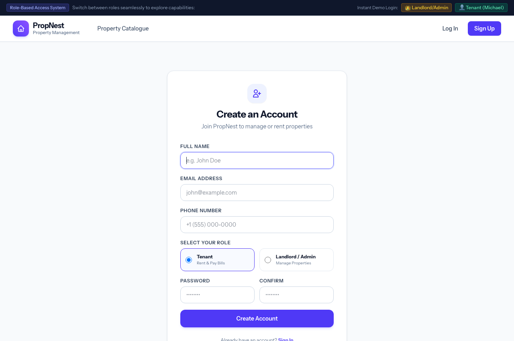

---

### Process 2: Secure Login & Instant Role Switcher
* **Actor**: All Users & Auditors
* **Route**: [`/login`](file:///Users/mobolaji/Herd/propertysystem/routes/web.php#L27) (`GET`, `POST`)
* **Controller**: [`AuthController@showLogin`](file:///Users/mobolaji/Herd/propertysystem/app/Http/Controllers/AuthController.php#L14)

Standard email/password credential verification with session regeneration to defend against session fixation attacks. For testing and demonstration purposes, 1-click demo login buttons are provided on both the login screen and global navbar to effortlessly switch between **Landlord (Alexander Vance)** and **Tenant (Michael Chen)** contexts.

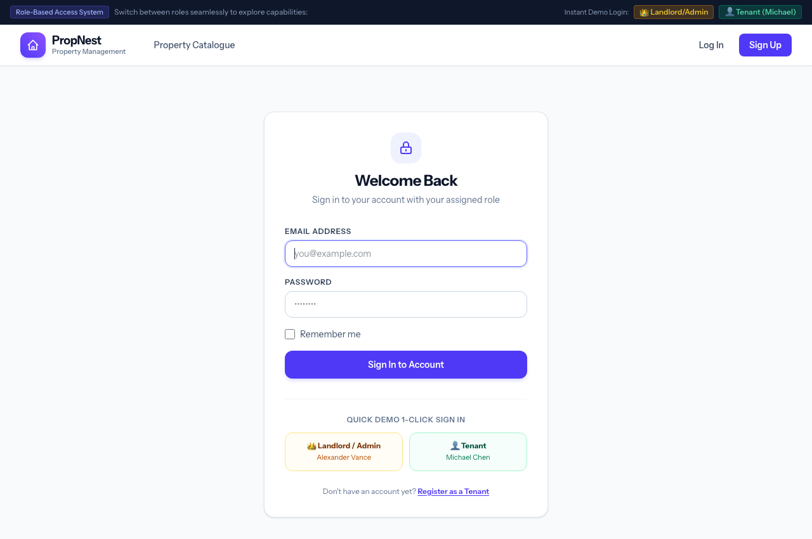

---

## Component II: User-Friendly and Responsive Interface

The user interface is crafted using **Tailwind CSS v4** and modern typography (**Instrument Sans**). The interface automatically adapts between high-resolution desktop viewports, tablets, and smartphones.

Key interface highlights:
* **Top Navigation Bar**: Global branding, dynamic context menu tailored to the authenticated role, quick action CTA (`+ Add Property` for Landlord, `Pay Bill / Rent` for Tenant), live unread notification badge counter, and user profile avatar.
* **Top Demo Switcher Bar**: Persistent quick-switching banner allowing pair programmers and evaluators to swap roles without logging out manually.
* **Responsive Data Cards**: Metric KPIs, property cards with badge indicators, and tabular views that collapse into clean cards on mobile devices.

### Process 3: Tenant Dashboard Overview
* **Actor**: Authenticated Tenant (Michael Chen)
* **Route**: [`/dashboard`](file:///Users/mobolaji/Herd/propertysystem/routes/web.php#L38)
* **Controller**: [`DashboardController@index`](file:///Users/mobolaji/Herd/propertysystem/app/Http/Controllers/DashboardController.php#L14)

The tenant dashboard displays:
1. **Active Tenancy Unit**: Property hero, address, bedrooms, bathrooms, and monthly rent rate.
2. **Key Metric Tiles**: Active Rent Status, Outstanding Bill Balance, and Open Maintenance Tickets.
3. **Pending Bill Tracker**: Immediate settlement shortcut for rent or utility charges.
4. **Recent Maintenance Activity**: Live status of reported issues.

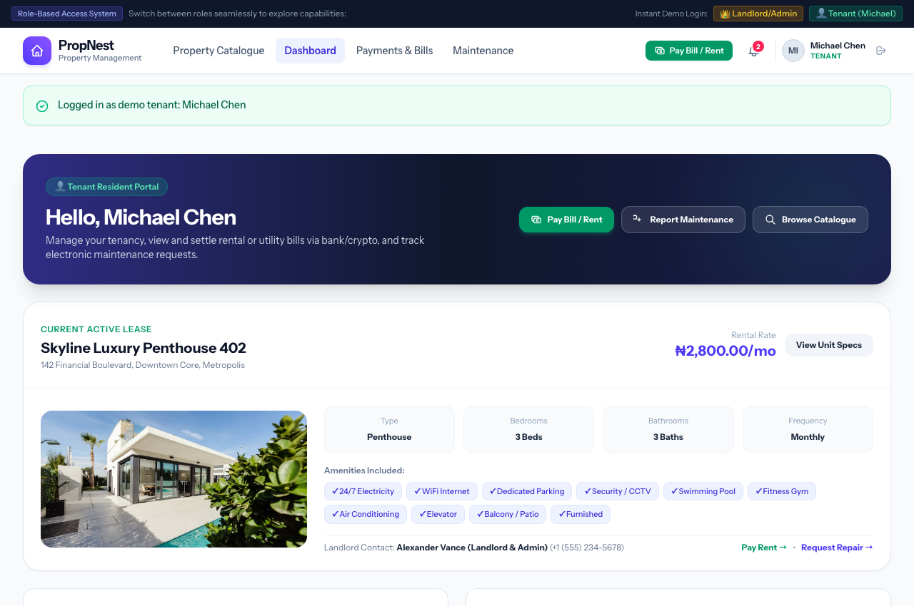

---

### Process 4: Landlord Administrative Dashboard
* **Actor**: Authenticated Landlord / Admin (Alexander Vance)
* **Route**: [`/dashboard`](file:///Users/mobolaji/Herd/propertysystem/routes/web.php#L38)
* **Controller**: [`DashboardController@index`](file:///Users/mobolaji/Herd/propertysystem/app/Http/Controllers/DashboardController.php#L14)

The landlord administrative center provides full managerial command:
1. **Executive Portfolio KPIs**: Total Units Managed, Active Occupancy Rate, Total Revenue Collected, and Pending Payment Verification Volume.
2. **Payment Auditing Alert Queue**: Direct action buttons to review tenant payment slips.
3. **Open Work Order Triage**: Maintenance requests requiring technician dispatch.
4. **Property Portfolio Health Table**: Breakdown of rented vs available units with assigned tenant names.

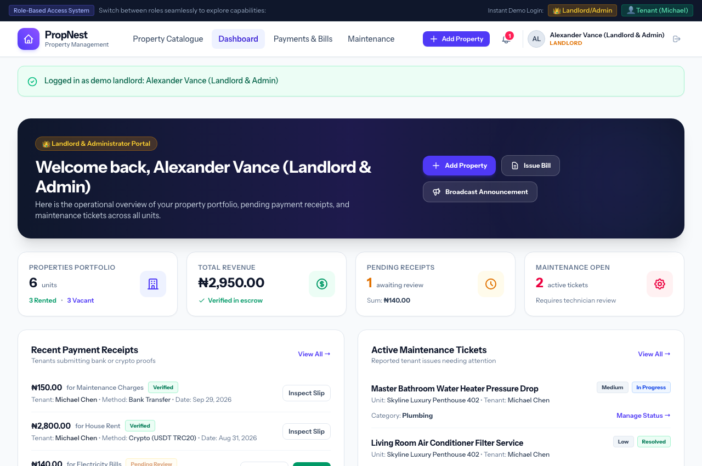

---

## Component III: Property Catalogue and Management

### Process 5: Multi-Criteria Property Catalogue
* **Actor**: Public Visitors, Prospective Tenants, and Current Residents
* **Route**: [`/catalogue`](file:///Users/mobolaji/Herd/propertysystem/routes/web.php#L23)
* **Controller**: [`PropertyController@index`](file:///Users/mobolaji/Herd/propertysystem/app/Http/Controllers/PropertyController.php#L15)

The catalogue lets users explore all listed properties in the portfolio with interactive real-time filters:
* **Search Keyword**: Property title, city, or street address.
* **Property Type**: Apartment, Penthouse, Duplex, Villa, Studio, Commercial.
* **Pricing & Space**: Maximum monthly budget slider, minimum bedrooms, minimum bathrooms.
* **Facility Checkboxes**: 24/7 Electricity, WiFi Internet, Dedicated Parking, CCTV, Swimming Pool, Gym.
* **Unit Availability Badges**: `Available for Rent` vs `Occupied / Rented`.

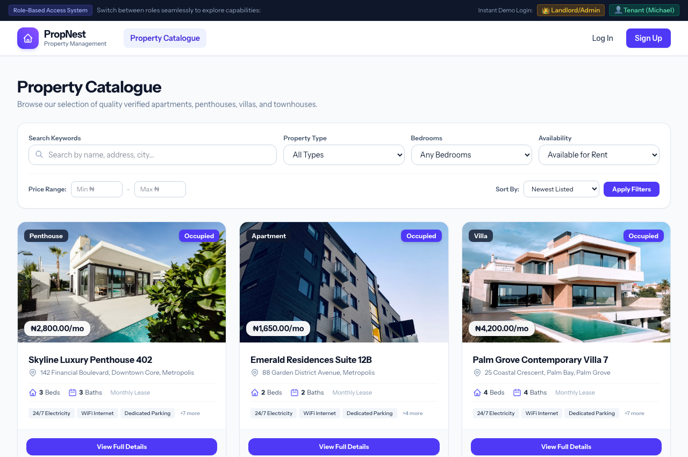

---

### Process 6: Property Specification & Showcase
* **Actor**: Residents & Visitors
* **Route**: [`/properties/{id}`](file:///Users/mobolaji/Herd/propertysystem/routes/web.php#L87)
* **Controller**: [`PropertyController@show`](file:///Users/mobolaji/Herd/propertysystem/app/Http/Controllers/PropertyController.php#L90)

A comprehensive listing showcase containing:
* High-resolution visual gallery and unit overview.
* Monthly rent pricing, security deposit terms, and frequency.
* Exact bedroom and bathroom specifications.
* Curated amenities grid with icon badges.
* Integrated Landlord contact details and Tenancy Manager interface (for administrators).

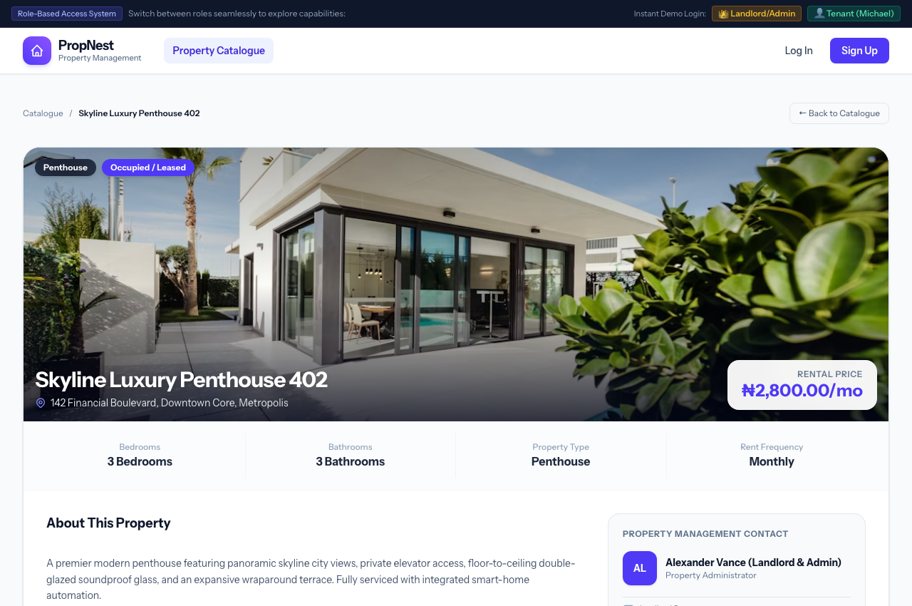

---

### Process 7: Landlord Property Listing Creation
* **Actor**: Landlord / Administrator
* **Route**: [`/admin/properties/create`](file:///Users/mobolaji/Herd/propertysystem/routes/web.php#L65)
* **Controller**: [`PropertyController@create`](file:///Users/mobolaji/Herd/propertysystem/app/Http/Controllers/PropertyController.php#L45)

Landlords can publish new rental properties with comprehensive metadata:
* Title, street address, city, and property classification.
* Bedrooms, bathrooms, rental price ($ USD), and payment cycle (monthly/quarterly/annually).
* Featured photo URL or file upload.
* Interactive facility checkboxes (Power, WiFi, Parking, Pool, AC, Security, etc.).
* Optional initial tenant assignment from registered tenant accounts.

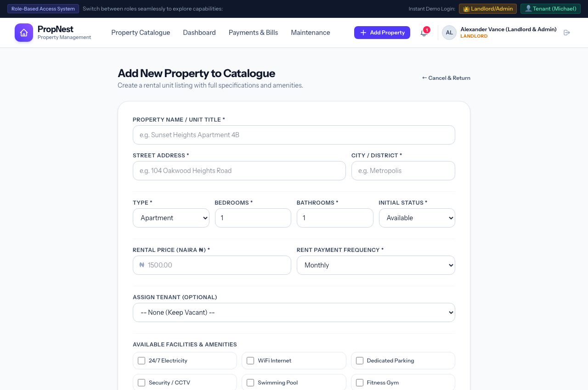

---

## Component IV: Rent and Payment Management

PropNest provides a payment management system featuring both conventional banking channels and modern cryptocurrency escrow options.

### Process 8: Tenant Payment Center & Settlement Channels
* **Actor**: Authenticated Tenant
* **Route**: [`/payments`](file:///Users/mobolaji/Herd/propertysystem/routes/web.php#L50)
* **Controller**: [`PaymentController@index`](file:///Users/mobolaji/Herd/propertysystem/app/Http/Controllers/PaymentController.php#L17)

The Payment Center equips tenants with verified payment options:
1. **Bank Wire & Electronic Transfer**: Beneficiary Bank, Escrow Account Title, Account Number with 1-click clipboard copy, and SWIFT/Routing info.
2. **Cryptocurrency Payment Facility**:
   * **Tether (USDT TRC-20)**: Tron Network wallet address with copy button.
   * **Bitcoin (BTC)**: Native SegWit wallet address.
   * **Ethereum (ETH / USDT ERC-20)**: ERC-20 smart contract destination.
3. **Outstanding Invoices List**: Itemized pending bills with `Pay Now` buttons.
4. **Historical Payment Ledger**: Status tags (`Pending Verification`, `Verified & Approved`, `Rejected`).

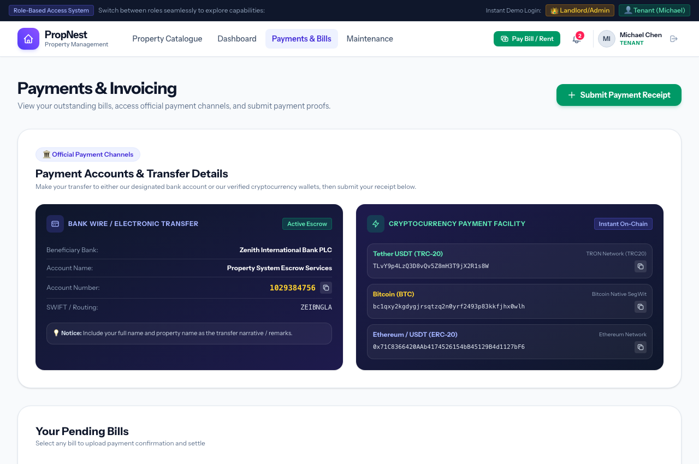

---

### Process 9: Payment Receipt & Proof Submission
* **Actor**: Authenticated Tenant
* **Route**: [`/payments/create`](file:///Users/mobolaji/Herd/propertysystem/routes/web.php#L51)
* **Controller**: [`PaymentController@create`](file:///Users/mobolaji/Herd/propertysystem/app/Http/Controllers/PaymentController.php#L34)

When submitting proof of payment:
* **Linked Bill**: Tenant selects the invoice being settled (`House Rent`, `Electricity`, or `Maintenance`).
* **Payment Method**: Bank Transfer, Cryptocurrency (USDT/BTC/ETH), Debit Card, or Cash Deposit.
* **Amount Paid & Transaction Reference / On-Chain TX Hash**: Allows instant audit cross-referencing.
* **Receipt File Upload**: Upload bank slip or block explorer screenshot (PNG, JPG, PDF).
* **Optional Remarks**: Additional notes for the landlord audit ledger.

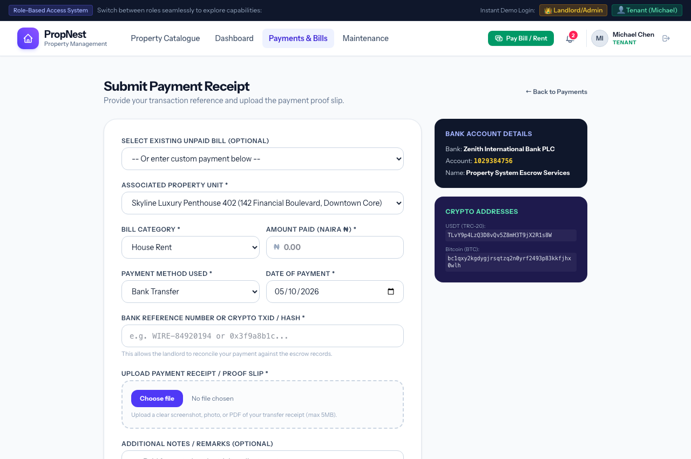

---

### Process 10: Official Printable Receipt Slip
* **Actor**: Tenant & Landlord
* **Route**: [`/payments/{id}`](file:///Users/mobolaji/Herd/propertysystem/routes/web.php#L53)
* **Controller**: [`PaymentController@show`](file:///Users/mobolaji/Herd/propertysystem/app/Http/Controllers/PaymentController.php#L72)

Upon verification, the system issues an official, verifiable digital payment receipt featuring:
* Unique Receipt Serial Number (`#PN-000001`).
* Verification Stamp (`✓ Verified & Approved`).
* Amount Settled, Payment Channel, and Settlement Timestamp.
* Resident & Unit Particulars.
* Transaction Reference / On-chain Hash and Landlord Audit Remarks.
* Browser-native `Print / Save Receipt` action.

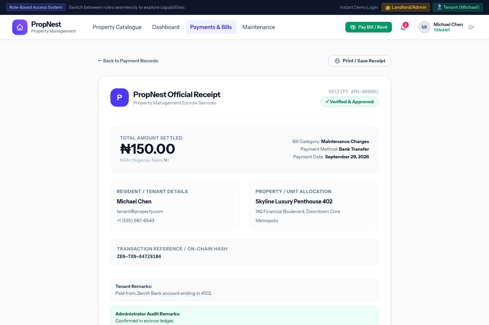

---

### Process 11: Landlord Invoicing Ledger & Audit Approval
* **Actor**: Landlord / Administrator
* **Route**: [`/payments`](file:///Users/mobolaji/Herd/propertysystem/routes/web.php#L50)
* **Controller**: [`PaymentController@index`](file:///Users/mobolaji/Herd/propertysystem/app/Http/Controllers/PaymentController.php#L17)

The Landlord Payment Management view features:
1. **Total Cash Inflow Metrics**: Total Approved Funds, Pending Verification Queue, and Active Unsettled Invoices.
2. **Audit Action Panel**: Submitted tenant slips can be reviewed with 1-click **Verify & Approve** or **Reject** actions.
3. **Bill Issuance CTA**: Direct shortcut to create new rental or utility invoices.

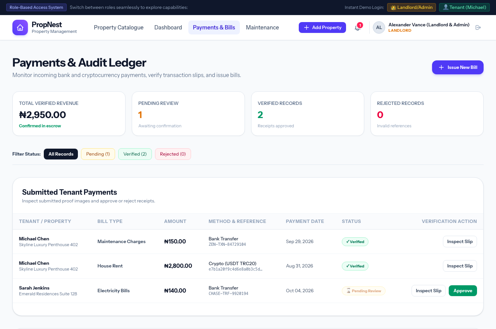

---

### Process 12: Landlord Direct Bill Issuance
* **Actor**: Landlord / Administrator
* **Route**: [`/admin/bills/create`](file:///Users/mobolaji/Herd/propertysystem/routes/web.php#L73)
* **Controller**: [`PaymentController@createBill`](file:///Users/mobolaji/Herd/propertysystem/app/Http/Controllers/PaymentController.php#L130)

Landlords issue invoices to tenants by defining:
* Target property and automatically resolved tenant.
* Bill Category: `House Rent`, `Electricity Bill`, `Maintenance Charges`, or `Water Utility`.
* Invoice Amount ($ USD) and Due Date.
* Description and custom billing narrative.  
* Upon submission, the tenant instantly receives a high-priority system notification.

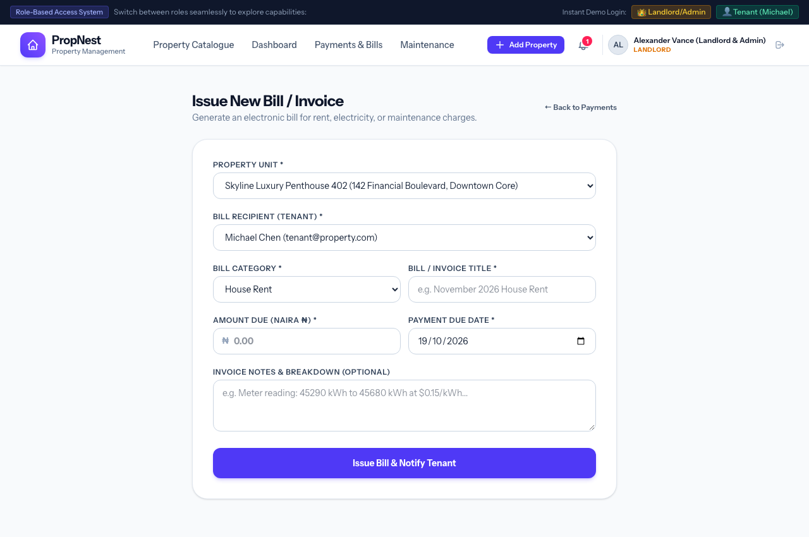

---

## Component V: Maintenance and Notification Management

### Process 13: Tenant Maintenance Request Submission
* **Actor**: Authenticated Tenant
* **Route**: [`/maintenance/create`](file:///Users/mobolaji/Herd/propertysystem/routes/web.php#L57)
* **Controller**: [`MaintenanceController@create`](file:///Users/mobolaji/Herd/propertysystem/app/Http/Controllers/MaintenanceController.php#L31)

Tenants report maintenance issues through a dedicated form:
* **Category**: Plumbing, Electrical, HVAC / Air Conditioning, Structural, Appliance, Pest Control, or Security.
* **Urgency Level**: `Low`, `Medium`, `High`, or `Urgent Emergency`.
* **Issue Title & Narrative**: Detailed description of the defect.
* **Defect Photo Upload**: Evidence photo attached directly to the work order.

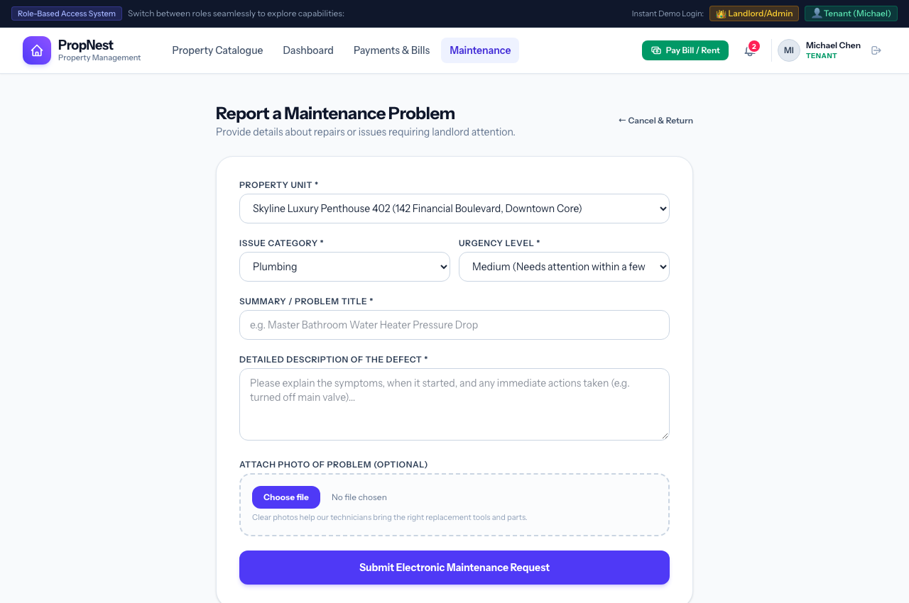

---

### Process 14: Maintenance Ticket Progress Timeline Tracker
* **Actor**: Tenant & Landlord
* **Route**: [`/maintenance/{id}`](file:///Users/mobolaji/Herd/propertysystem/routes/web.php#L59)
* **Controller**: [`MaintenanceController@show`](file:///Users/mobolaji/Herd/propertysystem/app/Http/Controllers/MaintenanceController.php#L68)

Both parties can monitor ticket progress with a visual step-by-step lifecycle bar:
1. **Submitted**: Defect logged by resident with timestamp.
2. **Technician Dispatched / In Progress**: Contractor or repair team assigned.
3. **Resolved**: Work confirmed complete with resolution notes.

The view displays the reported description, attached defect photo, technician schedule, and landlord administrative status controls.

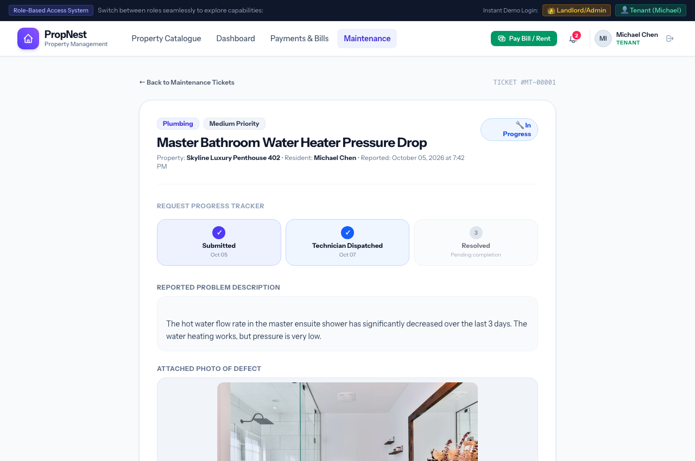

---

### Process 15: Landlord Maintenance Work Order Queue
* **Actor**: Landlord / Administrator
* **Route**: [`/maintenance`](file:///Users/mobolaji/Herd/propertysystem/routes/web.php#L56)
* **Controller**: [`MaintenanceController@index`](file:///Users/mobolaji/Herd/propertysystem/app/Http/Controllers/MaintenanceController.php#L16)

The Landlord Maintenance console centralizes incoming requests across the entire portfolio:
* Filter tickets by status (`Pending`, `In Progress`, `Resolved`, `Cancelled`).
* View urgency badges, unit numbers, resident names, and elapsed response times.
* Update ticket state or dispatch repair contractors with a single click.

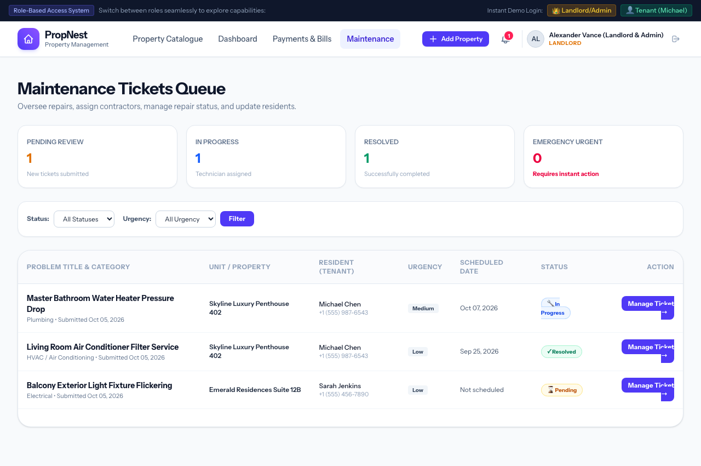

---

### Process 16: System Notifications & Alert Feed
* **Actor**: All Authenticated Users
* **Route**: [`/notifications`](file:///Users/mobolaji/Herd/propertysystem/routes/web.php#L45)
* **Controller**: [`NotificationController@index`](file:///Users/mobolaji/Herd/propertysystem/app/Http/Controllers/NotificationController.php#L14)

A centralized notifications center:
* Color-coded category tags (`Payment Alert`, `Maintenance Update`, `General Announcement`).
* Direct action links (e.g. `View Receipt`, `View Work Order`).
* 1-click `Mark as Read` and `Mark All as Read` buttons.
* Real-time sync with top navbar pill badge counter.

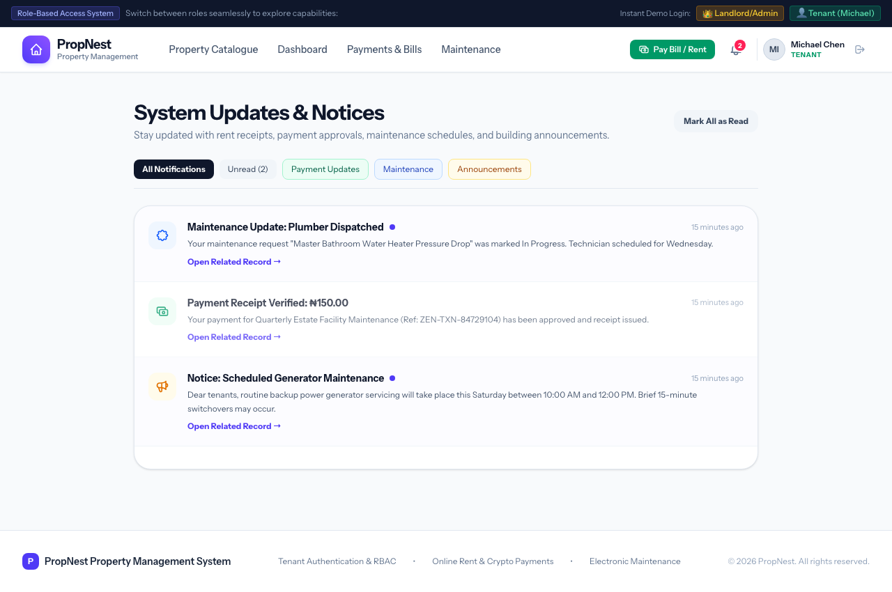

---

### Process 17: Landlord Portfolio Broadcast Announcement
* **Actor**: Landlord / Administrator
* **Route**: [`/admin/announcements/create`](file:///Users/mobolaji/Herd/propertysystem/routes/web.php#L82)
* **Controller**: [`NotificationController@createAnnouncement`](file:///Users/mobolaji/Herd/propertysystem/app/Http/Controllers/NotificationController.php#L42)

Landlords can broadcast building-wide notifications (e.g., generator maintenance, water supply schedules, seasonal notices):
* Select target: Broadcast to all tenants or residents of a specific building.
* Custom Title, Priority Level, and Announcement Message.
* On submission, the system dispatches notifications to all selected residents.

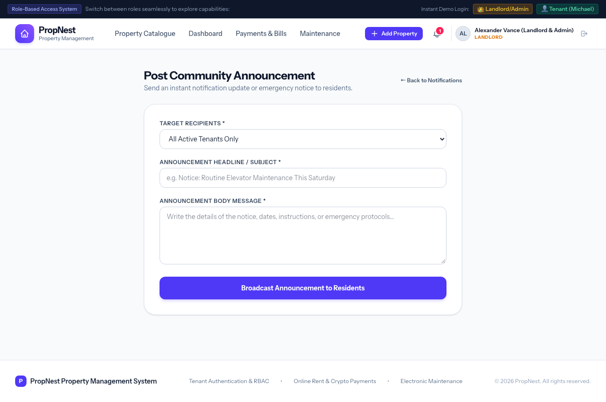

---

## Technical Verification Summary

| Suite / Test Case | File | Status |
| :--- | :--- | :--- |
| **Authentication & RBAC Tests** | [`tests/Feature/AuthTest.php`](file:///Users/mobolaji/Herd/propertysystem/tests/Feature/AuthTest.php) | `PASS` (7 assertions) |
| **Property Catalogue & Management** | [`tests/Feature/PropertyTest.php`](file:///Users/mobolaji/Herd/propertysystem/tests/Feature/PropertyTest.php) | `PASS` (18 assertions) |
| **Billing & Payments Management** | [`tests/Feature/PaymentTest.php`](file:///Users/mobolaji/Herd/propertysystem/tests/Feature/PaymentTest.php) | `PASS` (24 assertions) |
| **Maintenance & Notification Dispatch** | [`tests/Feature/MaintenanceTest.php`](file:///Users/mobolaji/Herd/propertysystem/tests/Feature/MaintenanceTest.php) | `PASS` (26 assertions) |
| **Visual Capture Execution** | [`capture_all.js`](file:///Users/mobolaji/Herd/propertysystem/capture_all.js) | `17/17 Screenshots Verified` |

---
*Report generated for PropNest Property Management System.*
